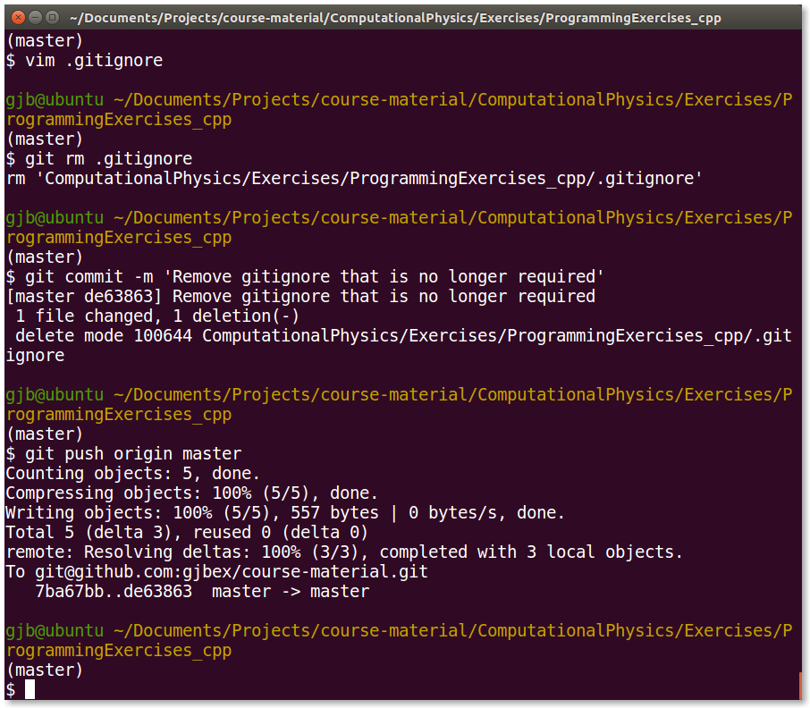

# Bash prompt

Religious wars have been fought over the best possible shell prompt, so I
will not claim that this is the ultimate and best prompt.  However, this
is one that helps me keep track of relevant information, and that keeps
my terminal window fairly uncluttered.

This is the defintion for `PS``` in my `.bashrc`, the other prompt
definitions I leave unaltered from their defaults.
```
PS1='\[\e]0;\w\a\]\n\[\e[32m\]\u@\h \[\e[33m\]\w\n\$ '
```

The prompt shows the user ID and hostname, followed by the current working
directory. This information is colored green, so it is easily
distinguishable from commands and their output, hence clearly separating
one command from the next.

The advantace is that even when one is very deep in a directory structure,
prompt itself is always on a line by itself, e.g.,



Using a different color per host allows to distinguish at a glance
between various hosts.
